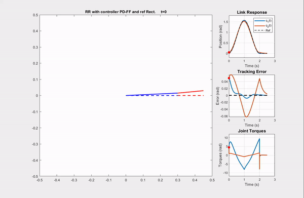

# Robot-Modeling-and-Control !!!!!

This work starts from following some contents taught in the course ROB 599 - Robot Modeling and Control in the University of Michigan - Ann Arbor.

## Reference

* R. Murray, Z. Li, and S. Sastry, A Mathematical Introduction to Robotic Manipulation, 
  CRC Press, Boca Raton, FL, 1994. 
* Mark W. Spong, Seth Hutchinson, and M. Vidyasagar, Robot Modeling and Control, 
  John Wiley & Sons, Inc., New York, NY, 2006. 
